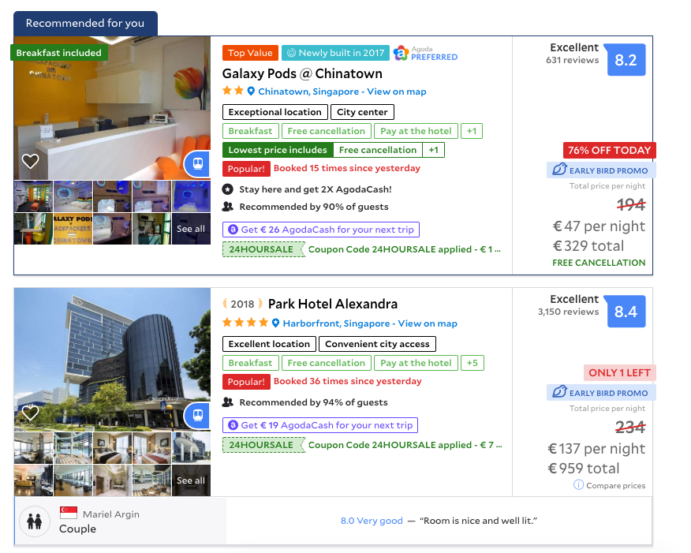
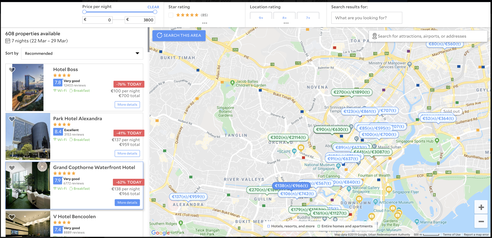

# Chrome New Tab - Event Countdown

A simple chrome extension to add the total price of a stay to Agodas listings.

|  |  |
|---|---|

# Installation
This isn't available on the Chrome store, so installation must be done manually.

1. Download THE zip with the extension from the latest release on the [releases page](https://github.com/smithalan92/agoda-total-price/releases)
2. Extract the folder from the zip and move it somewhere you won't accidently delet it.
3. Go to chrome://extensions in Google Chrome. Enable developer mode up the top right if it's not already enabled.
4. Click the "Load unpacked" button and select the extension directory you moved above.
5. Thats it, next time you go to Agoda.com and search for accommodation, the total price of the stay will automatically be calculated and displayed.

# Building Locally

1. Clone the repo
2. Make sure Node v8 + is installed
3. Run `npm i` to install project dependencies.
4. Run `npm run build` , an extension directory will be created which you can load into chrome.

Note: `npm run build` runs a bash script. 